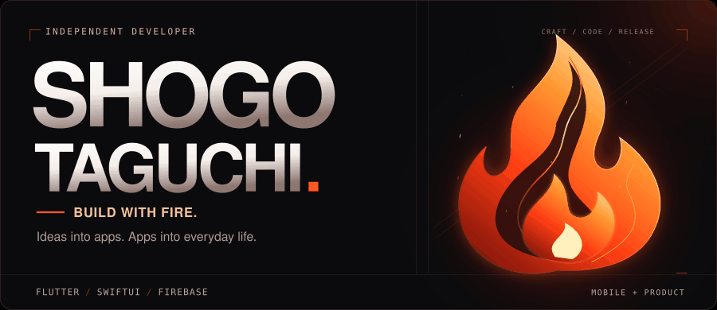

  <picture>
    <source media="(prefers-reduced-motion: reduce)" srcset="assets/profile-hero.svg?v=motion" />
    
  </picture>

  <b>田口 将伍 · Mobile App Developer</b> 
  東京電機大学 情報システム工学科 / 28卒 
  身近な課題を、使い続けたくなるプロダクトに。

  <a href="https://apps.apple.com/jp/app/strive/id6770878590">App Store ↗</a>
  &nbsp; / &nbsp;
  <a href="https://strive-lp-xi.vercel.app/">Website ↗</a>
  &nbsp; / &nbsp;
  <a href="mailto:jcm2bd9rn5@privaterelay.appleid.com">Contact ↗</a>

 

  <b>「負けたくない」を、続ける力に。</b> 
  記録・成長の可視化・友人との競争で筋トレを支えるアプリ。企画から設計・実装・公開・改善まで担当。

### Behind the build

- **きっかけ：** 自分の筋トレ経験から、前回記録をすぐ確認でき、友人との競争も継続の力になるアプリを作りたいと考えました。
- **担当範囲：** UI設計、認証、データ保存、課金、ストア公開、公開後の改善まで一貫して担当しています。
- **実装の工夫：** Androidの休憩通知は、正確な時刻指定で予約できない場合に別方式で再試行。終了済みタイマーの通知予約も防いでいます。

[設計・実装のメモを読む →](docs/strive-engineering.md)

<table>
  <tr>
    <td width="50%" valign="top">
       
      撮る瞬間も楽しめる、チェキ風カメラ。 
      個人開発 / 試作済み・開発休止中
    </td>
    <td width="50%" valign="top">
       
      <b>サポーターズ賞 受賞</b> 
      チーム開発 / フロントエンド実装・発表を担当
    </td>
  </tr>
</table>

  プロダクト開発・エンジニアインターンに関心があります。

